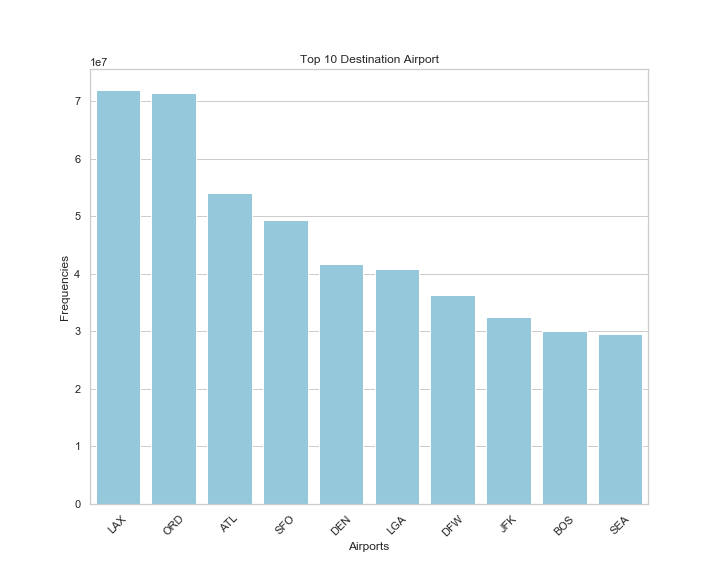

1

## Total Airfare

Unsurprisingly, the total money spent on airfare rose steadily over time. Growth was stagnant, however, from 2014 to 2017.

 

## Total Frequencies by Year

In terms of flight volumes, the most popular times to fly during the year are early summer and the winter holiday season. January through March are the slowest times of year.

Flight volumes have risen steadily over the study period, but unlike total receipts from airfare, growth continued between 2014 and 2017.

 

## Departures by Destination State

The vast majority of flights are concentrated in a minority of states.

 

## Departures by Origin State

Compared to the beginning of the decade, flights are spread relatively more evenly among the states (except for California).

## Top 10 Destination Airports

Each of the top 10 destination airports are major hubs.

## Flights by Top 5 Carriers

Delta began and ended the decade as the airline operating the greatest number of flights.

## OD Volumes

Explore the flight volumes between Origin and Destination pairs with the map below.

## Ticket Price vs. Flight Distance.

This scatterplot shows the relationship between Ticket Price, our dependent variable, and Flight Distance, one of the independent variables in our model.

## Correlation Matrix for the Linear Model

## Errors for Final Model

## Percent Errors

## Percent Error by Price

